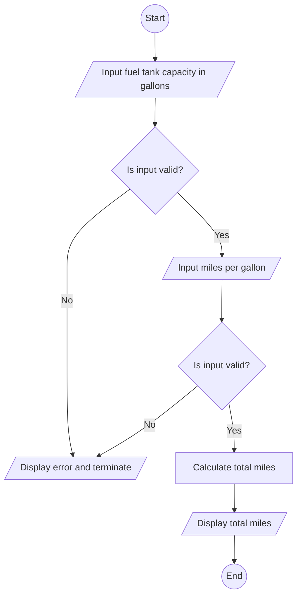

## Automobile mile calculator

---

### Problem

Write a program that prompts the capacity in gallons of an automobile fuel tank and the miles per gallons the automobiles can be driven. The program outputs the number miles the automobile cam be driven without refueling.

### Problem analtsis

> - **Input**: gas capacity(_gallon_), distance Automobile can go per gallon(_mile_)

> - **Process**: calculate total mile can be mover with full tank

> - **Output**: total miles

## Algorithm design

### Pseudocode

> **Step 1**: Start  
> **Step 2**: declare variables gallon gas(_double_), mile gallon(_double_), total mile(_double_)  
> **Step 3**: read gas in gallon(gallon gas)  
> **Step 4**: check gas in galon
>
> > 4.1: if input is invalid or less than 0, print invalid input  
> > 4.2: if input is valid and greater than or equal to 0, go to **Step 5**
>
> **Step 5**: read mile per galon(mile galon)  
> **Step 6**: check mile galon
>
> > 6.1: if input is invalid or less than 0, print invalid input  
> > 6.2: if input is valid and greater than or equal to 0, go to **Step 7**
>
> **Step 7**: calculate total mile as gallon gas \* miles per gallon  
> **Step 8**: print total miles  
> **Step 9**: Stop

### FLow chart

