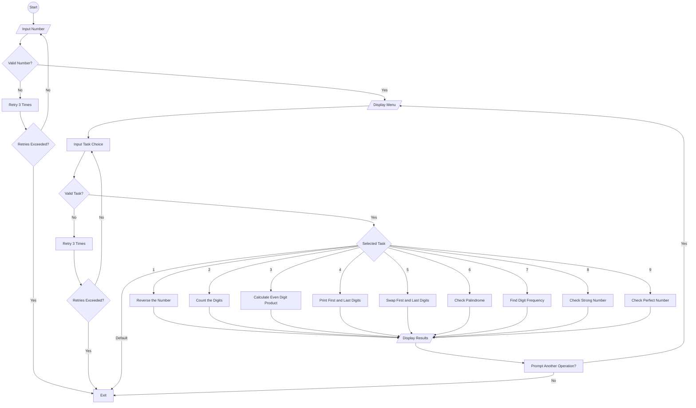

# Algorithm 
## steps

1. Prompt the user to enter an integer (`number`).
   - Validate the input; if invalid:
     - Clear input buffer.
     - Allow up to 3 retries; otherwise, exit.

2. Provide options for operations (e.g., reverse, digit count, even digit product, etc.).

3. Prompt the user to choose a task from the menu.
   - Validate the input; if invalid:
     - Clear input buffer.
     - Allow up to 3 retries; otherwise, exit.

4. - **Option 1**: Reverse the number.
   - **Option 2**: Count the number of digits.
   - **Option 3**: Calculate the product of even digits.
   - **Option 4**: Print the first and last digit and their sum.
   - **Option 5**: Swap the first and last digits.
   - **Option 6**: Check if the number is a palindrome.
   - **Option 7**: Find the frequency of each digit.
   - **Option 8**: Check if the number is a Strong number.
   - **Option 9**: Check if the number is a Perfect number.
   - **Any Other Input**: Exit the program.

5. Display results based on the selected task.

6.  Return to the menu for another operation unless exited.

7. **End**.

