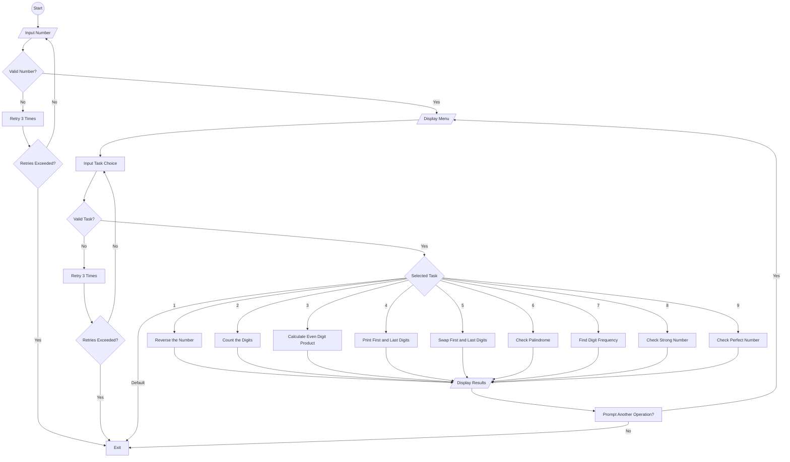

```mermaid
flowchart TD
    A((Start)) --> B[/Input Number/]
    B --> C{Valid Number?}
    C -- No --> D[Retry 3 Times] --> E{Retries Exceeded?}
    E -- Yes --> F[Exit]
    E -- No --> B
    C -- Yes --> G[/Display Menu/]
    G --> H[Input Task Choice]
    H --> I{Valid Task?}
    I -- No --> J[Retry 3 Times] --> K{Retries Exceeded?}
    K -- Yes --> F
    K -- No --> H
    I -- Yes --> L{Selected Task}
    L -- 1 --> M[Reverse the Number]
    L -- 2 --> N[Count the Digits]
    L -- 3 --> O[Calculate Even Digit Product]
    L -- 4 --> P[Print First and Last Digits]
    L -- 5 --> Q[Swap First and Last Digits]
    L -- 6 --> R[Check Palindrome]
    L -- 7 --> S[Find Digit Frequency]
    L -- 8 --> T[Check Strong Number]
    L -- 9 --> U[Check Perfect Number]
    L -- Default --> F
    M --> V[/Display Results/]
    N --> V
    O --> V
    P --> V
    Q --> V
    R --> V
    S --> V
    T --> V
    U --> V
    V --> W[Prompt Another Operation?]
    W -- Yes --> G
    W -- No --> F
```
