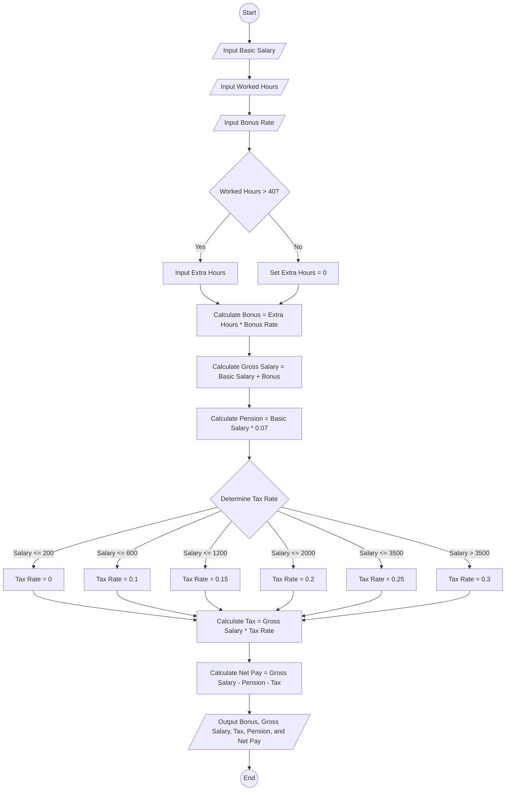

```mermaid
flowchart TD
    A((Start)) --> B[/Input Basic Salary/]
    B --> C[/Input Worked Hours/]
    C --> D[/Input Bonus Rate/]
    D --> E{Worked Hours > 40?}
    E -- Yes --> F[Input Extra Hours]
    E -- No --> G[Set Extra Hours = 0]
    F --> H[Calculate Bonus = Extra Hours * Bonus Rate]
    G --> H
    H --> I[Calculate Gross Salary = Basic Salary + Bonus]
    I --> J[Calculate Pension = Basic Salary * 0.07]
    J --> K{Determine Tax Rate}
    K -- Salary <= 200 --> L[Tax Rate = 0]
    K -- Salary <= 600 --> M[Tax Rate = 0.1]
    K -- Salary <= 1200 --> N[Tax Rate = 0.15]
    K -- Salary <= 2000 --> O[Tax Rate = 0.2]
    K -- Salary <= 3500 --> P[Tax Rate = 0.25]
    K -- Salary > 3500 --> Q[Tax Rate = 0.3]
    L --> R[Calculate Tax = Gross Salary * Tax Rate]
    M --> R
    N --> R
    O --> R
    P --> R
    Q --> R
    R --> S[Calculate Net Pay = Gross Salary - Pension - Tax]
    S --> T[/Output Bonus, Gross Salary, Tax, Pension, and Net Pay/]
    T --> U((End))
```
