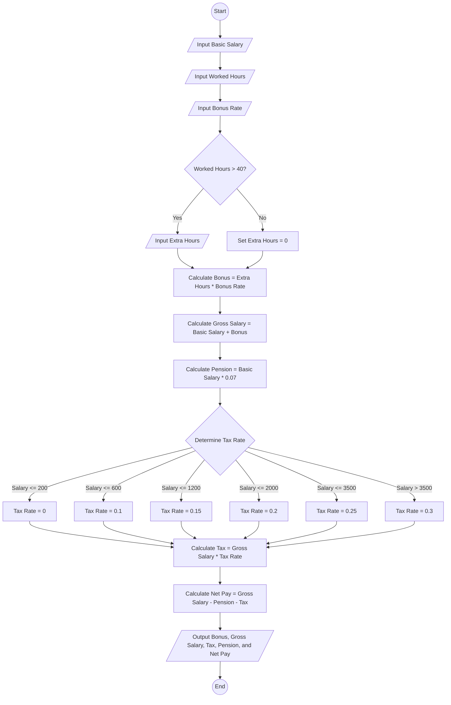

# Algorithm to Calculate Net Pay of an Employee

1.Prompt the user to enter the basic salary.
   - Store it in `basic_salary`.

2.  Prompt the user to enter the number of worked hours.
   - Store it in `worked_hours`.

3. Prompt the user to enter the bonus rate.
   - Store it in `bonus_rate`.

4. If `worked_hours > 40`, prompt the user to enter extra hours worked.
   - Store it in `extra_hour`.

5. Compute `bonus = extra_hour * bonus_rate`.

6. Compute `gross_salary = basic_salary + bonus`.

7. Compute `pension = basic_salary * 0.07`.

8. -If `basic_salary <= 200`, set `tax_rate = 0`.
   - Else if `basic_salary <= 600`, set `tax_rate = 0.1`.
   - Else if `basic_salary <= 1200`, set `tax_rate = 0.15`.
   - Else if `basic_salary <= 2000`, set `tax_rate = 0.2`.
   - Else if `basic_salary <= 3500`, set `tax_rate = 0.25`.
   - Otherwise, set `tax_rate = 0.3`.

9. Compute `tax = gross_salary * tax_rate`.

10. Compute `net_pay = gross_salary - pension - tax`.

11.  Display `bonus`, `gross_salary`, `tax`, `pension`, and `net_pay`.
