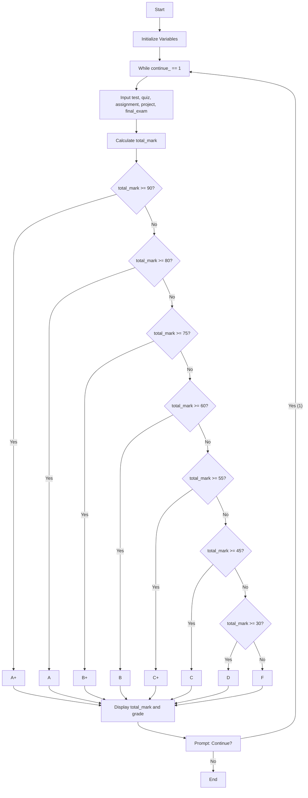

# Algorithm 

1. **Initialize Variables**:
   - `test`, `quiz`, `assignment`, `project`, `final_exam`, `total_mark`, and `continue_`.

2. **Start While Loop**:
   - Loop continues as long as `continue_ == 1`.

3. **Input Scores**:
   - Prompt the user to enter scores for:
     - `test`
     - `quiz`
     - `assignment`
     - `project`
     - `final_exam`.

4. **Calculate Total Mark**:
   - Use the formula:
     ```
     total_mark = (test * 0.15) + (quiz * 0.05) + (assignment * 0.1) + (project * 0.2) + (final_exam * 0.5)
     ```

5.Based on `total_mark`, assign grades:
     - `A+` for marks >= 90.
     - `A` for marks >= 80.
     - `B+` for marks >= 75.
     - `B` for marks >= 60.
     - `C+` for marks >= 55.
     - `C` for marks >= 45.
     - `D` for marks >= 30.
     - `F` for marks < 30.

6. Print `total_mark` and corresponding grade.

7. Ask the user if they want to grade another result.
   - If the user enters `1`, continue. Otherwise, exit.

8.  If `continue_ != 1`, terminate the program.


## Flowchart 



