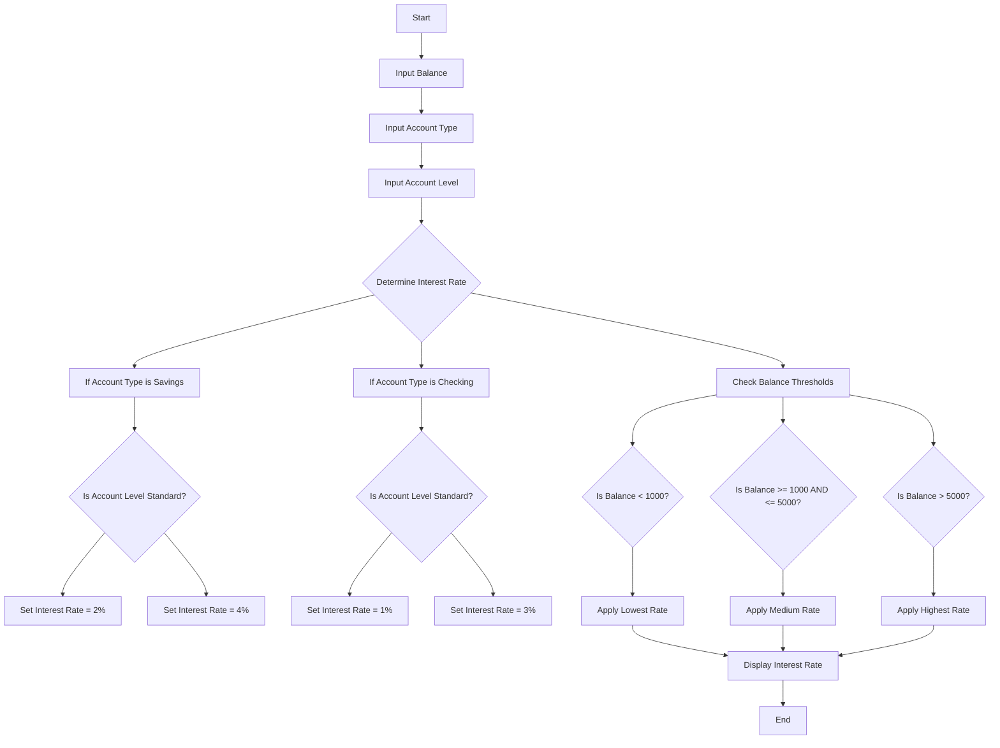

```mermaid

graph TD;
    A[Start] --> B[Input Balance];
    B --> C[Input Account Type];
    C --> D[Input Account Level];
    D --> E{Determine Interest Rate};
    E --> F[If Account Type is Savings];
    F --> G{Is Account Level Standard?};
    G --> H[Set Interest Rate = 2%];
    G --> I[Set Interest Rate = 4%];
    E --> J[If Account Type is Checking];
    J --> K{Is Account Level Standard?};
    K --> L[Set Interest Rate = 1%];
    K --> M[Set Interest Rate = 3%];
    E --> N[Check Balance Thresholds];
    N --> O{Is Balance < 1000?};
    O --> P[Apply Lowest Rate];
    N --> Q{Is Balance >= 1000 AND <= 5000?};
    Q --> R[Apply Medium Rate];
    N --> S{Is Balance > 5000?};
    S --> T[Apply Highest Rate];
    P --> U[Display Interest Rate];
    R --> U;
    T --> U;
    U --> V[End];
```
