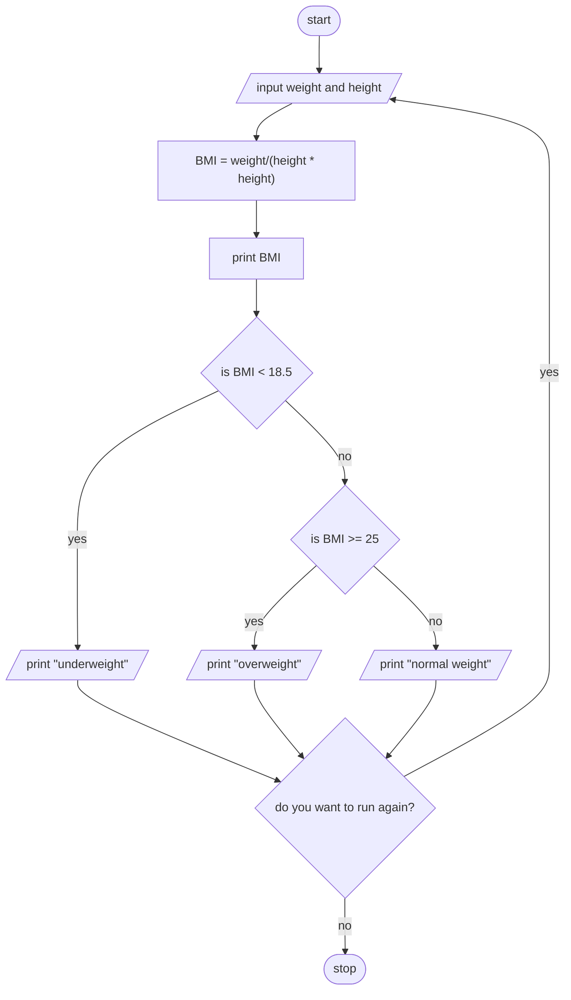

### Pseudocode for BMI Calculator Program

1. **Start**
   - Begin the program.

2. **Input**
   - **Prompt User**: Ask the user how many people's BMIs they want to calculate.
   - **Receive Input**: Store the number of people in a variable called `numPeople`.

3. **Processing**
   - **Loop**: For each person from 1 to `numPeople`:
     A. **Input Mass**:
        - **Prompt the User**: Ask the user to enter the mass (in kilograms).
        - **Receive Input**: Store the mass in a variable called `massInKg`.
     
     B. **Input Height**:
        - **Prompt the User**: Ask the user to enter the height (in meters).
        - **Receive Input**: Store the height in a variable called `heightInMeters`.
     
     C. **Calculate BMI**:
        - **Compute BMI**: Use the formula:
          ```
          BMI = massInKg / (heightInMeters * heightInMeters)
          ```

     D. **Output BMI**:
        - **Display the Calculated BMI**: Output the value of `BMI`.
     
     E. **Classify BMI**:
        - **Determine Weight Classification**:
          - If `BMI < 18.5`, classify as "Underweight".
          - If `18.5 ≤ BMI ≤ 24.9`, classify as "Normal weight".
          - If `BMI > 24.9`, classify as "Overweight".
        
        - **Output Classification**: Display the classification result.

4. **End**
   - **Completion Message**: After all calculations are complete, print a message indicating that the BMI calculations are complete.
   - **Terminate Program**: End the program.

### Flowchart : Body Mass Index



